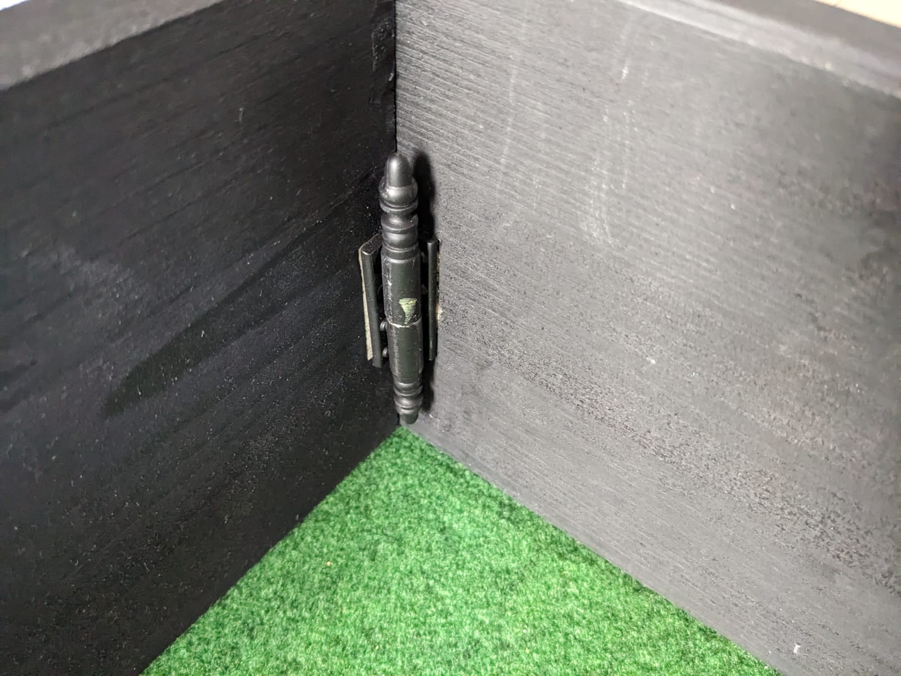
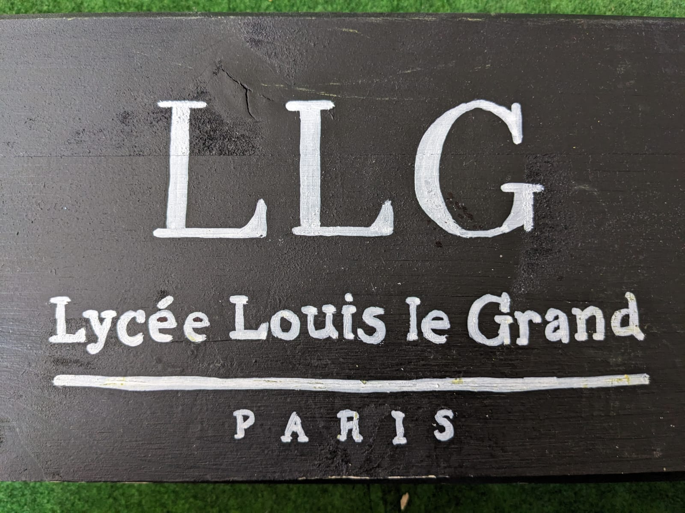
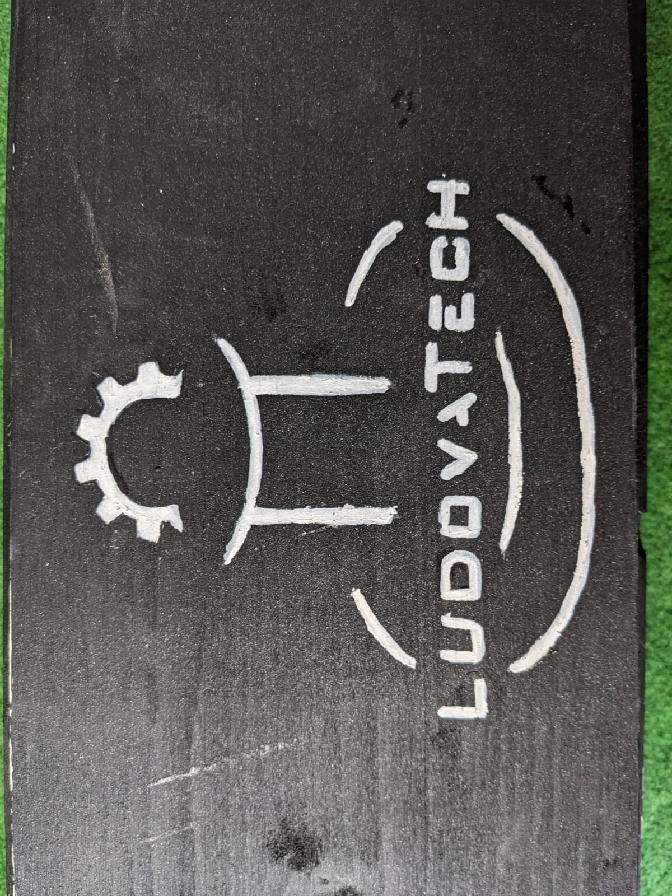
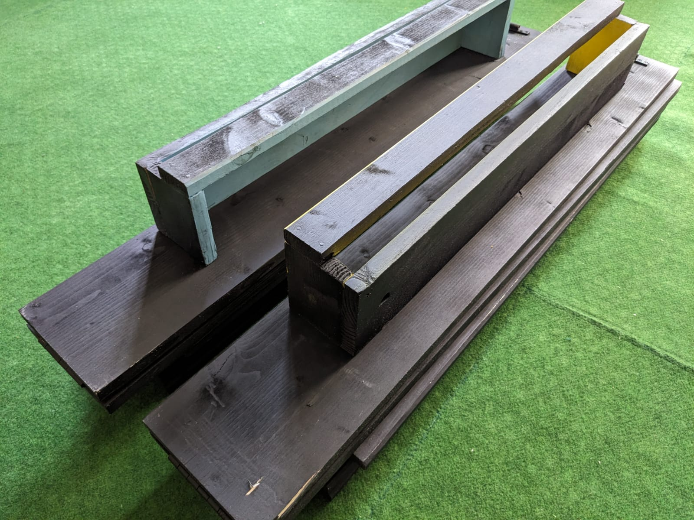

# Field Construction

### Summary
- [Intro](#intro)
- [Materials](#materials)
- [Dimensions](#dimensions)
- [Fasteners](#fasteners)
- [Paint and logos](#paint-and-logos)
- [Assembly and transport](#assembly-and-transport)
- [License](#license)

## Intro
To conduct our tests under the **best conditions**, we decided to create our own field. The goal is to adhere precisely to the dimensions of conventional fields and to be easily **transportable**. We will now outline our entire construction process so that you can reproduce it **yourself**.

## Materials
For the construction of the walls and goals, we decided to use **pine/fir** wood. This type of wood is strong enough for our purposes and is very easy to transport due to its light weight. \

The field area itself is simply a piece of **carpet** that we cut and stitched according to the conventional competition dimensions. We chose it for its green color and durability. However, it is quite heavy, so it is advisable to find a thinner carpet. \

Finally, the hinges to be used are **metal** for added strength. \

## Dimensions
During the design of our field, we decided to create walls that could fold, unfold, and interlock easily. Therefore, we chose to cut the longer walls into three parts of the same dimensions: **81 x 15 x 1,8 cm**.

The width is composed of two boards with the following dimensions: **93 x 15 x 1,8 cm**.

The goals adhere to more precise dimensions. A goal is composed of:
- Two boards for the sides of the goals with the following dimensions: **7,4 x 10 x 1,8 cm**
- One board for the back of the goals with the following dimensions: **64 x 10 x 1,8 cm**
- One board for the top of the goals with the following dimensions: **64 x 4 x 1,8 cm**

> [!TIP]
> To make your life easier, you can ask a hardware store to do the cutting for you.

The carpet respects the dimensions of the conventional field but has margins of 3 cm on each side. So, here are its dimensions: **188 x 249 cm**.

The hinges used to attach the boards together have a height of **less than 15 cm**.

## Fasteners
To secure the boards next to each other, we used **metal hinges** capable of unfolding to 180°. These hinges are attached to the boards with **screws** of length **less than 1.8 cm**. \
For the width, a single hinge is used to attach the two boards each 93 cm long. \
For the length, two hinges are used. Attach the first two boards, each 81 cm long, with one hinge, then attach the second board to a third board with a hinge placed on the **opposite side** to the wall of the first hinge.
> [!WARNING]
> Make sure to position the hinges between the boards accurately and orient them precisely in the width direction. \
> When you fold the lengthwise boards, they should form a 'Z' shape.

Now that the walls are created, they need to be assembled together. We used a different type of hinge for this: **butt hinges**. These hinges must be fixed in all four interior corners of the field. For the widths, install the butt hinges on the same side as the other hinges. The choice of side for the lengths does not matter.
> [!WARNING]
> The widths of the field must frame the lengths. This means the ends of the lengths must touch the inside edges of the widths. \
> Ensure you consider the size of your butt hinges and position them correctly so they can interlock smoothly without any issues. \
> Position the butt hinges at the same height so that any width can be fixed to any length.

For creating the goals, we used **wood glue** and **nails**. Apply glue along the thickness of the two smaller side boards, then attach them to the back board of the goals. Next, glue the last prepared board onto the tops of the goals. After the glue has dried, reinforce the goals by driving nails perpendicularly through the glued surfaces.

## Paint and logos
We painted the walls and goals using **spray cans** of color. **Matte** black was used for the walls and the backs of the goals to minimize reflections as much as possible. For the goals, bright yellow and light blue were applied. Finally, after the paint on the walls dried, we drew our logos using a white marker and stencils.

> [!TIP]
> For painting the goals, you can cover the already painted surfaces with masking tape to prevent accidental staining or repainting. \
> Consider applying multiple layers for a better result. \
> You can create your own stencils by cutting out a sheet with your logo printed on it.

Since our robot doesn't use lines on the field for navigation, we didn't need to recreate them. However, if you need them, you can neatly trace the edges of the lines with a pen and then paint them with a brush or paint roller using white paint.
> [!TIP]
> You can still use masking tape to enhance the final result.

## Assembly and transport
Now that the walls, goals, and floor are done, you can transport and assemble your field anywhere! 🥳 Simply unroll your green carpet, unfold the walls, assemble them, and place the goals! All the equipment for the field can easily fit into one or two large bags!

## License

<a property="dct:title" rel="cc:attributionURL" href="https://github.com/LudovaTech/build-robocup-junior-open-soccer-field-tutorial">build-robocup-junior-open-soccer-field-tutorial</a> by <a rel="cc:attributionURL dct:creator" property="cc:attributionName" href="https://github.com/LudovaTech">LudovaTech (Gandalfph)</a> is licensed under <a href="https://creativecommons.org/licenses/by-nc-sa/4.0/?ref=chooser-v1" target="_blank" rel="license noopener noreferrer" style="display:inline-block;">CC BY-NC-SA 4.0</a>
